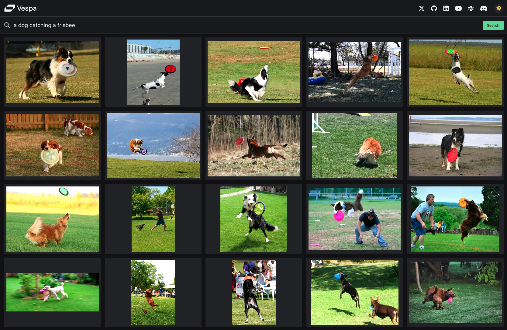

# Vespa Semantic Image Search

This demo application takes a textual description and returns images that best match the description.

For example, the query "a dog catching a frisbee" will return images with dogs catching frisbees. Information 
about what is in an image is not stored in Vespa: search results are entirely based on image **content**, meaning 
that this application would work with any set of images.



This is achieved using embeddings from a pre-trained [CLIP Model](https://openai.com/index/clip/) to perform an ANN search - entirely within Vespa.

The application also features a beautiful web frontend for displaying search results and getting search suggestions.

There is a [blog post](https://blog.vespa.ai/text-image-search/) describing the inner workings of the .

# Getting started

There are two versions of this app: a [java version]() showcasing a custom Vespa Java API, and a [python version]() showcasing PyVespa.

Head over to their respective branches to set up an environment to start hacking on this application!

```bash
# Java Version
git clone -b java https://github.com/Mangern/vespa-image-search-hack-pack.git

# Python Version
git clone -b penne-pixels https://github.com/Mangern/vespa-image-search-hack-pack.git
```
